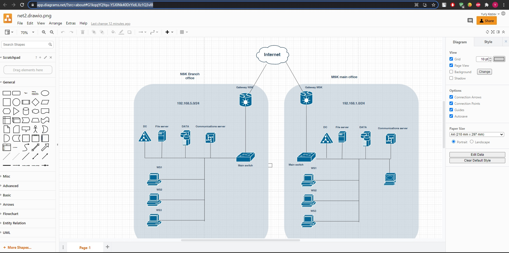

# Домашнее задание к занятию "3.8. Компьютерные сети, лекция 3"

1. Подключитесь к публичному маршрутизатору в интернет. Найдите маршрут к вашему публичному IP
```
telnet route-views.routeviews.org
Username: rviews
show ip route x.x.x.x/32
show bgp x.x.x.x/32
```

Мои результаты:
```
route-views>show ip route 185.171.100.142
Routing entry for 185.171.100.0/23
  Known via "bgp 6447", distance 20, metric 0
  Tag 6939, type external
  Last update from 64.71.137.241 7w0d ago
  Routing Descriptor Blocks:
  * 64.71.137.241, from 64.71.137.241, 7w0d ago
      Route metric is 0, traffic share count is 1
      AS Hops 2
      Route tag 6939
      MPLS label: none
route-views>show bgp 185.171.100.142
BGP routing table entry for 185.171.100.0/23, version 1027283279
Paths: (24 available, best #23, table default)
  Not advertised to any peer
  Refresh Epoch 1
  3267 20485 61111, (aggregated by 61111 185.171.100.0)
    194.85.40.15 from 194.85.40.15 (185.141.126.1)
      Origin IGP, metric 0, localpref 100, valid, external, atomic-aggregate
      path 7FE0D88B34D0 RPKI State not found
      rx pathid: 0, tx pathid: 0
  Refresh Epoch 1
  20912 3257 9002 61111, (aggregated by 61111 185.171.100.0)
    212.66.96.126 from 212.66.96.126 (212.66.96.126)
      Origin IGP, localpref 100, valid, external, atomic-aggregate
      Community: 3257:8052 3257:50001 3257:54900 3257:54901 20912:65004 65535:65284
      path 7FE12719A6A8 RPKI State not found
      rx pathid: 0, tx pathid: 0
  Refresh Epoch 3
  3303 9002 61111, (aggregated by 61111 185.171.100.0)
    217.192.89.50 from 217.192.89.50 (138.187.128.158)
      Origin IGP, localpref 100, valid, external, atomic-aggregate
      Community: 3303:1004 3303:1007 3303:1030 3303:3067 9002:64667
      path 7FE0F137A3D0 RPKI State not found
      rx pathid: 0, tx pathid: 0
```

---

2. Создайте dummy0 интерфейс в Ubuntu. Добавьте несколько статических маршрутов. Проверьте таблицу маршрутизации.

```
root@ubuntu:/home/us# modprobe -v dummy numdummies=2
insmod /lib/modules/5.11.0-41-generic/kernel/drivers/net/dummy.ko numdummies=0 numdummies=2
root@ubuntu:/home/us# lsmod | grep dummy
dummy                  16384  0
root@ubuntu:/home/us# ip a
3: dummy0: <BROADCAST,NOARP> mtu 1500 qdisc noop state DOWN group default qlen 1000
    link/ether 76:88:ad:79:3f:10 brd ff:ff:ff:ff:ff:ff
4: dummy1: <BROADCAST,NOARP> mtu 1500 qdisc noop state DOWN group default qlen 1000
    link/ether 62:44:89:83:bb:c5 brd ff:ff:ff:ff:ff:ff

root@ubuntu:/home/us# ip addr add 192.168.7.253/24 dev dummy0
root@ubuntu:/home/us# ip addr add 192.168.7.254/24 dev dummy1
root@ubuntu:/home/us# ip -br a
lo               UNKNOWN        127.0.0.1/8 ::1/128
enp0s3           UP             192.168.5.162/24 fe80::eb66:e6e5:f2c9:fa73/64
dummy0           UNKNOWN        192.168.7.253/32 fe80::7488:adff:fe79:3f10/64
dummy1           UNKNOWN        192.168.7.254/32 fe80::6044:89ff:fe83:bbc5/64

```
Добавлю маршруты:
```
root@ubuntu:/home/us# ip -br r
default via 192.168.5.2 dev enp0s3 proto dhcp metric 100
10.0.10.0/30 via 192.168.5.100 dev enp0s3
10.0.10.0/24 via 192.168.5.100 dev enp0s3
169.254.0.0/16 dev enp0s3 scope link metric 1000
172.16.10.0/24 via 192.168.5.1 dev enp0s3
192.168.5.0/24 dev enp0s3 proto kernel scope link src 192.168.5.162 metric 100
192.168.7.0/30 via 192.168.7.254 dev dummy1
```

---

3. Проверьте открытые TCP порты в Ubuntu, какие протоколы и приложения используют эти порты? Приведите несколько примеров.

Посмотрим на TCP сначала c помощью lsof:
```
root@zabbix:~# sudo lsof -nP -iTCP
COMMAND       PID            USER   FD   TYPE    DEVICE SIZE/OFF NODE NAME
sshd          834            root    3u  IPv4     24330      0t0  TCP *:22 (LISTEN)
sshd          834            root    4u  IPv6     24341      0t0  TCP *:22 (LISTEN)
apache2       869            root    4u  IPv6     24665      0t0  TCP *:80 (LISTEN)
mysqld        915           mysql   22u  IPv4     25718      0t0  TCP 127.0.0.1:33060 (LISTEN)
mysqld        915           mysql   35u  IPv4     25723      0t0  TCP 127.0.0.1:3306 (LISTEN)
zabbix_se    1011          zabbix    4u  IPv4     26008      0t0  TCP *:10051 (LISTEN)
zabbix_se    1011          zabbix    5u  IPv6     26009      0t0  TCP *:10051 (LISTEN)
zabbix_se    1017          zabbix    4u  IPv4     26008      0t0  TCP *:10051 (LISTEN)
zabbix_se    1017          zabbix    5u  IPv6     26009      0t0  TCP *:10051 (LISTEN)
zabbix_se    1030          zabbix    4u  IPv4     26008      0t0  TCP *:10051 (LISTEN)
zabbix_se    1030          zabbix    5u  IPv6     26009      0t0  TCP *:10051 (LISTEN)
zabbix_se    1031          zabbix    4u  IPv4     26008      0t0  TCP *:10051 (LISTEN)
zabbix_se    1031          zabbix    5u  IPv6     26009      0t0  TCP *:10051 (LISTEN)
zabbix_se    1032          zabbix    4u  IPv4     26008      0t0  TCP *:10051 (LISTEN)
zabbix_se    1032          zabbix    5u  IPv6     26009      0t0  TCP *:10051 (LISTEN)
zabbix_se    1033          zabbix    4u  IPv4     26008      0t0  TCP *:10051 (LISTEN)
zabbix_se    1033          zabbix    5u  IPv6     26009      0t0  TCP *:10051 (LISTEN)
zabbix_se    1034          zabbix    4u  IPv4     26008      0t0  TCP *:10051 (LISTEN)
zabbix_se    1034          zabbix    5u  IPv6     26009      0t0  TCP *:10051 (LISTEN)
zabbix_se    1035          zabbix    4u  IPv4     26008      0t0  TCP *:10051 (LISTEN)
zabbix_se    1035          zabbix    5u  IPv6     26009      0t0  TCP *:10051 (LISTEN)
zabbix_se    1036          zabbix    4u  IPv4     26008      0t0  TCP *:10051 (LISTEN)
zabbix_se    1036          zabbix    5u  IPv6     26009      0t0  TCP *:10051 (LISTEN)
zabbix_se    1037          zabbix    4u  IPv4     26008      0t0  TCP *:10051 (LISTEN)
zabbix_se    1037          zabbix    5u  IPv6     26009      0t0  TCP *:10051 (LISTEN)
zabbix_se    1038          zabbix    4u  IPv4     26008      0t0  TCP *:10051 (LISTEN)
zabbix_se    1038          zabbix    5u  IPv6     26009      0t0  TCP *:10051 (LISTEN)
zabbix_se    1039          zabbix    4u  IPv4     26008      0t0  TCP *:10051 (LISTEN)
zabbix_se    1039          zabbix    5u  IPv6     26009      0t0  TCP *:10051 (LISTEN)
zabbix_se    1040          zabbix    4u  IPv4     26008      0t0  TCP *:10051 (LISTEN)
zabbix_se    1040          zabbix    5u  IPv6     26009      0t0  TCP *:10051 (LISTEN)
zabbix_se    1041          zabbix    4u  IPv4     26008      0t0  TCP *:10051 (LISTEN)
zabbix_se    1041          zabbix    5u  IPv6     26009      0t0  TCP *:10051 (LISTEN)
zabbix_se    1042          zabbix    4u  IPv4     26008      0t0  TCP *:10051 (LISTEN)
zabbix_se    1042          zabbix    5u  IPv6     26009      0t0  TCP *:10051 (LISTEN)
zabbix_se    1043          zabbix    4u  IPv4     26008      0t0  TCP *:10051 (LISTEN)
zabbix_se    1043          zabbix    5u  IPv6     26009      0t0  TCP *:10051 (LISTEN)
zabbix_se    1048          zabbix    4u  IPv4     26008      0t0  TCP *:10051 (LISTEN)
zabbix_se    1048          zabbix    5u  IPv6     26009      0t0  TCP *:10051 (LISTEN)
zabbix_se    1050          zabbix    4u  IPv4     26008      0t0  TCP *:10051 (LISTEN)
zabbix_se    1050          zabbix    5u  IPv6     26009      0t0  TCP *:10051 (LISTEN)
zabbix_se    1056          zabbix    4u  IPv4     26008      0t0  TCP *:10051 (LISTEN)
zabbix_se    1056          zabbix    5u  IPv6     26009      0t0  TCP *:10051 (LISTEN)
zabbix_se    1057          zabbix    4u  IPv4     26008      0t0  TCP *:10051 (LISTEN)
zabbix_se    1057          zabbix    5u  IPv6     26009      0t0  TCP *:10051 (LISTEN)
zabbix_se    1059          zabbix    4u  IPv4     26008      0t0  TCP *:10051 (LISTEN)
zabbix_se    1059          zabbix    5u  IPv6     26009      0t0  TCP *:10051 (LISTEN)
zabbix_se    1062          zabbix    4u  IPv4     26008      0t0  TCP *:10051 (LISTEN)
zabbix_se    1062          zabbix    5u  IPv6     26009      0t0  TCP *:10051 (LISTEN)
zabbix_se    1066          zabbix    4u  IPv4     26008      0t0  TCP *:10051 (LISTEN)
zabbix_se    1066          zabbix    5u  IPv6     26009      0t0  TCP *:10051 (LISTEN)
zabbix_se    1067          zabbix    4u  IPv4     26008      0t0  TCP *:10051 (LISTEN)
zabbix_se    1067          zabbix    5u  IPv6     26009      0t0  TCP *:10051 (LISTEN)
zabbix_se    1068          zabbix    4u  IPv4     26008      0t0  TCP *:10051 (LISTEN)
zabbix_se    1068          zabbix    5u  IPv6     26009      0t0  TCP *:10051 (LISTEN)
zabbix_se    1070          zabbix    4u  IPv4     26008      0t0  TCP *:10051 (LISTEN)
zabbix_se    1070          zabbix    5u  IPv6     26009      0t0  TCP *:10051 (LISTEN)
zabbix_se    1071          zabbix    4u  IPv4     26008      0t0  TCP *:10051 (LISTEN)
zabbix_se    1071          zabbix    5u  IPv6     26009      0t0  TCP *:10051 (LISTEN)
zabbix_se    1074          zabbix    4u  IPv4     26008      0t0  TCP *:10051 (LISTEN)
zabbix_se    1074          zabbix    5u  IPv6     26009      0t0  TCP *:10051 (LISTEN)
zabbix_se    1075          zabbix    4u  IPv4     26008      0t0  TCP *:10051 (LISTEN)
zabbix_se    1075          zabbix    5u  IPv6     26009      0t0  TCP *:10051 (LISTEN)
zabbix_se    1076          zabbix    4u  IPv4     26008      0t0  TCP *:10051 (LISTEN)
zabbix_se    1076          zabbix    5u  IPv6     26009      0t0  TCP *:10051 (LISTEN)
zabbix_se    1077          zabbix    4u  IPv4     26008      0t0  TCP *:10051 (LISTEN)
zabbix_se    1077          zabbix    5u  IPv6     26009      0t0  TCP *:10051 (LISTEN)
zabbix_se    1078          zabbix    4u  IPv4     26008      0t0  TCP *:10051 (LISTEN)
zabbix_se    1078          zabbix    5u  IPv6     26009      0t0  TCP *:10051 (LISTEN)
zabbix_se    1079          zabbix    4u  IPv4     26008      0t0  TCP *:10051 (LISTEN)
zabbix_se    1079          zabbix    5u  IPv6     26009      0t0  TCP *:10051 (LISTEN)
zabbix_se    1080          zabbix    4u  IPv4     26008      0t0  TCP *:10051 (LISTEN)
zabbix_se    1080          zabbix    5u  IPv6     26009      0t0  TCP *:10051 (LISTEN)
zabbix_se    1081          zabbix    4u  IPv4     26008      0t0  TCP *:10051 (LISTEN)
zabbix_se    1081          zabbix    5u  IPv6     26009      0t0  TCP *:10051 (LISTEN)
zabbix_se    1082          zabbix    4u  IPv4     26008      0t0  TCP *:10051 (LISTEN)
zabbix_se    1082          zabbix    5u  IPv6     26009      0t0  TCP *:10051 (LISTEN)
zabbix_se    1083          zabbix    4u  IPv4     26008      0t0  TCP *:10051 (LISTEN)
zabbix_se    1083          zabbix    5u  IPv6     26009      0t0  TCP *:10051 (LISTEN)
zabbix_se    1084          zabbix    4u  IPv4     26008      0t0  TCP *:10051 (LISTEN)
zabbix_se    1084          zabbix    5u  IPv6     26009      0t0  TCP *:10051 (LISTEN)
zabbix_ag  180515          zabbix    4u  IPv4   5282009      0t0  TCP *:10050 (LISTEN)
zabbix_ag  180515          zabbix    5u  IPv6   5282010      0t0  TCP *:10050 (LISTEN)
zabbix_ag  180517          zabbix    4u  IPv4   5282009      0t0  TCP *:10050 (LISTEN)
zabbix_ag  180517          zabbix    5u  IPv6   5282010      0t0  TCP *:10050 (LISTEN)
zabbix_ag  180518          zabbix    4u  IPv4   5282009      0t0  TCP *:10050 (LISTEN)
zabbix_ag  180518          zabbix    5u  IPv6   5282010      0t0  TCP *:10050 (LISTEN)
zabbix_ag  180519          zabbix    4u  IPv4   5282009      0t0  TCP *:10050 (LISTEN)
zabbix_ag  180519          zabbix    5u  IPv6   5282010      0t0  TCP *:10050 (LISTEN)
zabbix_ag  180520          zabbix    4u  IPv4   5282009      0t0  TCP *:10050 (LISTEN)
zabbix_ag  180520          zabbix    5u  IPv6   5282010      0t0  TCP *:10050 (LISTEN)
apache2   1180848        www-data    4u  IPv6     24665      0t0  TCP *:80 (LISTEN)
apache2   1180849        www-data    4u  IPv6     24665      0t0  TCP *:80 (LISTEN)
apache2   1180849        www-data   11u  IPv6 462574602      0t0  TCP 192.168.5.6:80->192.168.5.YYY:55111 (ESTABLISHED)
apache2   1180961        www-data    4u  IPv6     24665      0t0  TCP *:80 (LISTEN)
apache2   1181020        www-data    4u  IPv6     24665      0t0  TCP *:80 (LISTEN)
apache2   1181073        www-data    4u  IPv6     24665      0t0  TCP *:80 (LISTEN)
apache2   1181073        www-data   11u  IPv6 462574658      0t0  TCP 192.168.5.6:80->192.168.5.XXX:64118 (ESTABLISHED)
apache2   1181135        www-data    4u  IPv6     24665      0t0  TCP *:80 (LISTEN)
apache2   1181182        www-data    4u  IPv6     24665      0t0  TCP *:80 (LISTEN)
apache2   1181185        www-data    4u  IPv6     24665      0t0  TCP *:80 (LISTEN)
apache2   1181186        www-data    4u  IPv6     24665      0t0  TCP *:80 (LISTEN)
sshd      1181231            root    4u  IPv4 462571821      0t0  TCP 192.168.5.6:22->192.168.5.XXX:64089 (ESTABLISHED)
sshd      1181366              ss    4u  IPv4 462571821      0t0  TCP 192.168.5.6:22->192.168.5.XXX:64089 (ESTABLISHED)
apache2   1181404        www-data    4u  IPv6     24665      0t0  TCP *:80 (LISTEN)
systemd-r 2381040 systemd-resolve   13u  IPv4 246031027      0t0  TCP 127.0.0.53:53 (LISTEN)
```
И с помощью netstat:
```
root@zabbix:~# netstat -ntp
Active Internet connections (w/o servers)
Proto Recv-Q Send-Q Local Address           Foreign Address         State       PID/Program name
tcp        0      0 192.168.5.6:35832       192.168.5.UUU:10050     TIME_WAIT   -
tcp        0      0 127.0.0.1:10050         127.0.0.1:44154         TIME_WAIT   -
tcp        0      0 127.0.0.1:10050         127.0.0.1:45696         TIME_WAIT   -
tcp        0      0 192.168.5.6:48104       192.168.5.YYY:10050     TIME_WAIT   -
tcp        0    224 192.168.5.6:22          192.168.5.XXX:64089     ESTABLISHED 1181231/sshd: ss [p
tcp        0      0 127.0.0.1:10050         127.0.0.1:44350         TIME_WAIT   -
tcp        0      0 127.0.0.1:43742         127.0.0.1:10050         TIME_WAIT   -
tcp        0      0 192.168.5.6:35950       192.168.5.YYY:10050     TIME_WAIT   -
tcp        0      0 127.0.0.1:10050         127.0.0.1:44952         TIME_WAIT   -
tcp        0      0 192.168.5.6:48902       192.168.5.ZZZ:10050     TIME_WAIT   -
tcp        0      0 192.168.5.6:56164       192.168.5.XXX:445       ESTABLISHED -
tcp        0      0 127.0.0.1:10051         127.0.0.1:36504         TIME_WAIT   -
tcp        0      0 127.0.0.1:10050         127.0.0.1:44092         TIME_WAIT   -
tcp        0      0 192.168.5.6:33894       192.168.5.JJJ:10050     TIME_WAIT   -
tcp        0      0 192.168.5.6:49082       192.168.5.KKK:10050     TIME_WAIT   -
tcp        0      0 192.168.5.6:49726       192.168.5.YYY:10050     ESTABLISHED 1050/zabbix_server:
tcp        0      0 192.168.5.6:55622       192.168.5.FFF:10050     TIME_WAIT   -
tcp        0      0 127.0.0.1:10051         127.0.0.1:34940         TIME_WAIT   -
tcp        0      0 127.0.0.1:10050         127.0.0.1:44792         TIME_WAIT   -
tcp        0      0 127.0.0.1:10050         127.0.0.1:43942         TIME_WAIT   -
tcp        0      0 192.168.5.6:35628       192.168.5.OOO:10050     TIME_WAIT   -
tcp        0      0 127.0.0.1:10050         127.0.0.1:44042         TIME_WAIT   -
tcp        0      0 127.0.0.1:10050         127.0.0.1:44668         TIME_WAIT   -
tcp6       0      0 192.168.5.6:80          192.168.5.TTT:55214      TIME_WAIT   -
tcp6       0      0 192.168.5.6:80          192.168.5.TTT:55291      ESTABLISHED 1181542/apache2
tcp6       0      0 192.168.5.6:80          192.168.5.TTT:55290      ESTABLISHED 1180848/apache2
tcp6       0      0 192.168.5.6:80          192.168.5.TTT:55293      ESTABLISHED 1181186/apache2
tcp6       0      0 192.168.5.6:80          192.168.5.XXX:64484     ESTABLISHED 1180849/apache2
tcp6       0      0 192.168.5.6:80          192.168.5.XXX:64472     TIME_WAIT   -
tcp6       0      0 192.168.5.6:80          192.168.5.TTT:55221      TIME_WAIT   -
tcp6       0      0 192.168.5.6:80          192.168.5.TTT:55208      TIME_WAIT   -
tcp6       0      0 192.168.5.6:80          192.168.5.TTT:55287      TIME_WAIT   -
tcp6       0      0 192.168.5.6:80          192.168.5TTT:55211      TIME_WAIT   -
tcp6       0      0 192.168.5.6:80          192.168.5.XXX:64476     TIME_WAIT   -
tcp6       0      0 192.168.5.6:80          192.168.5.TTT:55207      TIME_WAIT   -
tcp6       0      0 192.168.5.6:80          192.168.5.TTT:55209      TIME_WAIT   -
tcp6       0      0 192.168.5.6:80          192.168.5.TTT:55210      TIME_WAIT   -
tcp6       0      0 192.168.5.6:80          192.168.5.XXX:64471     TIME_WAIT   -
tcp6       0      0 192.168.5.6:80          192.168.5.TTT:55217      TIME_WAIT   -
tcp6       0      0 192.168.5.6:80          192.168.5.TTT:55292      ESTABLISHED 1181135/apache2
tcp6       0      0 192.168.5.6:80          192.168.5.TTT:55222      TIME_WAIT   -
tcp6       0      0 192.168.5.6:80          192.168.5.XXX:64475     TIME_WAIT   -
```
В принципе по номерам портов видно что порты TCP используются заббиксом, апачем, http и ssh. А в выводе lsof так вообще всё подписано    

---

4. Проверьте используемые UDP сокеты в Ubuntu, какие протоколы и приложения используют эти порты?

По UDP портам вывод скромнее:  
```
root@zabbix:~# lsof -nP -iUDP
COMMAND       PID            USER   FD   TYPE    DEVICE SIZE/OFF NODE NAME
chronyd       767         _chrony    5u  IPv4     22545      0t0  UDP 127.0.0.1:323
chronyd       767         _chrony    6u  IPv6     22546      0t0  UDP [::1]:323
snmpd         791     Debian-snmp    6u  IPv4     24612      0t0  UDP 127.0.0.1:161
snmpd         791     Debian-snmp    7u  IPv6     24613      0t0  UDP [::1]:161
systemd-r 2381040 systemd-resolve   12u  IPv4 246031026      0t0  UDP 127.0.0.53:53
```
Netstat:  
```
root@zabbix:~# netstat -nu
Active Internet connections (w/o servers)
Proto Recv-Q Send-Q Local Address           Foreign Address         State
```
Здесь только протоколы chrony, SNMP и DNS используют порты.  

---

5. Используя diagrams.net, создайте L3 диаграмму вашей домашней сети или любой другой сети, с которой вы работали. 

Нарисовал [тут](https://app.diagrams.net/?src=about#G1kqqYQYqu-YSJ0Nk40DrYIdLJIz1Q3vl8) и на всякий случай скрин:



---

## Задание для самостоятельной отработки (необязательно к выполнению)

6*. Установите Nginx, настройте в режиме балансировщика TCP или UDP.

7*. Установите bird2, настройте динамический протокол маршрутизации RIP.

8*. Установите Netbox, создайте несколько IP префиксов, используя curl проверьте работу API.

 ---

## Как сдавать задания

Обязательными к выполнению являются задачи без указания звездочки. Их выполнение необходимо для получения зачета и диплома о профессиональной переподготовке.

Задачи со звездочкой (*) являются дополнительными задачами и/или задачами повышенной сложности. Они не являются обязательными к выполнению, но помогут вам глубже понять тему.

Домашнее задание выполните в файле readme.md в github репозитории. В личном кабинете отправьте на проверку ссылку на .md-файл в вашем репозитории.

Также вы можете выполнить задание в [Google Docs](https://docs.google.com/document/u/0/?tgif=d) и отправить в личном кабинете на проверку ссылку на ваш документ.
Название файла Google Docs должно содержать номер лекции и фамилию студента. Пример названия: "1.1. Введение в DevOps — Сусанна Алиева".

Если необходимо прикрепить дополнительные ссылки, просто добавьте их в свой Google Docs.

Перед тем как выслать ссылку, убедитесь, что ее содержимое не является приватным (открыто на комментирование всем, у кого есть ссылка), иначе преподаватель не сможет проверить работу. Чтобы это проверить, откройте ссылку в браузере в режиме инкогнито.

[Как предоставить доступ к файлам и папкам на Google Диске](https://support.google.com/docs/answer/2494822?hl=ru&co=GENIE.Platform%3DDesktop)

[Как запустить chrome в режиме инкогнито ](https://support.google.com/chrome/answer/95464?co=GENIE.Platform%3DDesktop&hl=ru)

[Как запустить  Safari в режиме инкогнито ](https://support.apple.com/ru-ru/guide/safari/ibrw1069/mac)

Любые вопросы по решению задач задавайте в чате Slack.

---

