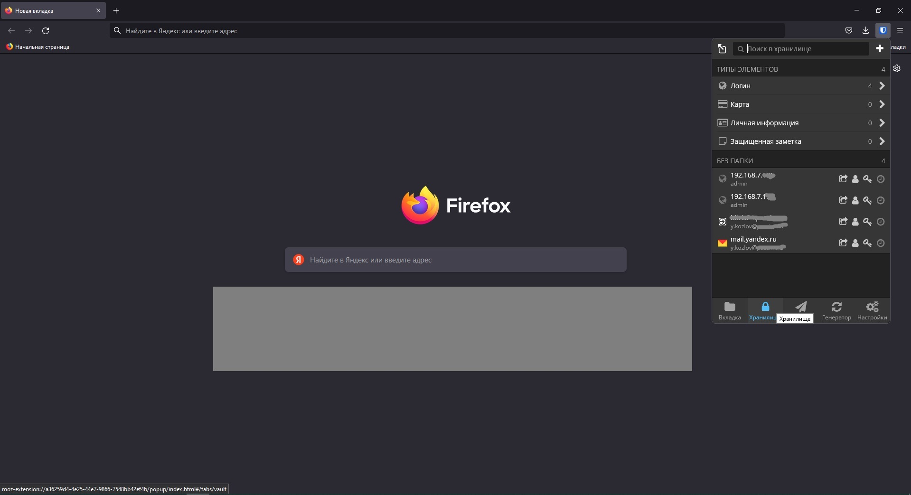
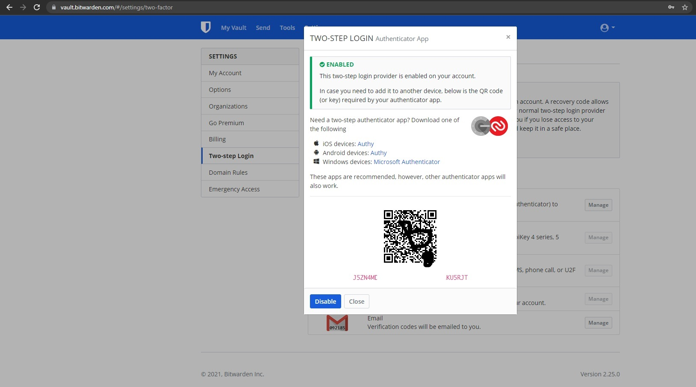
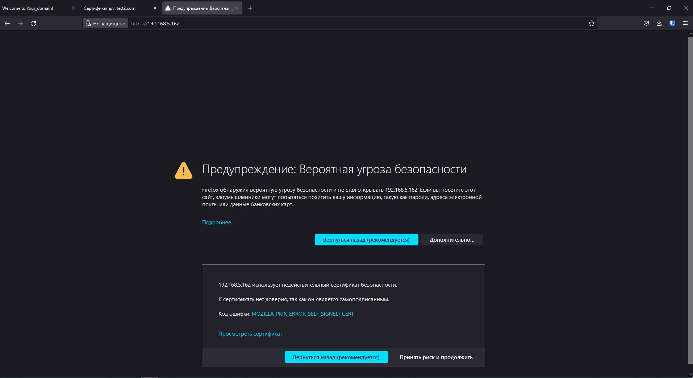
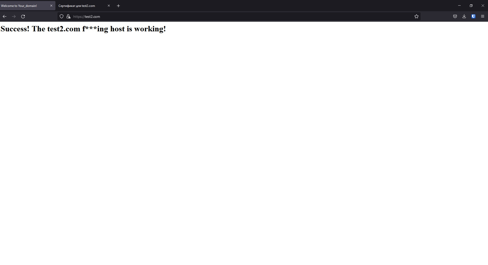
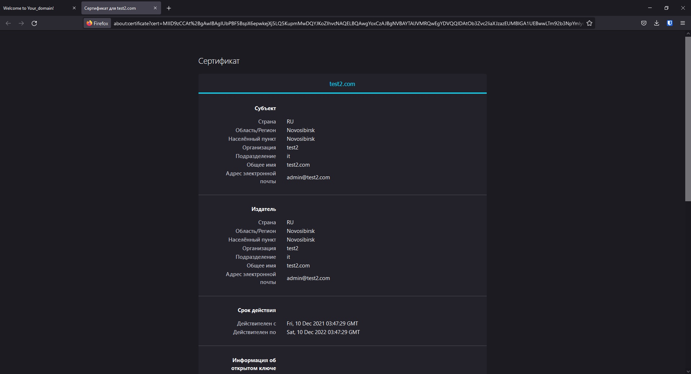
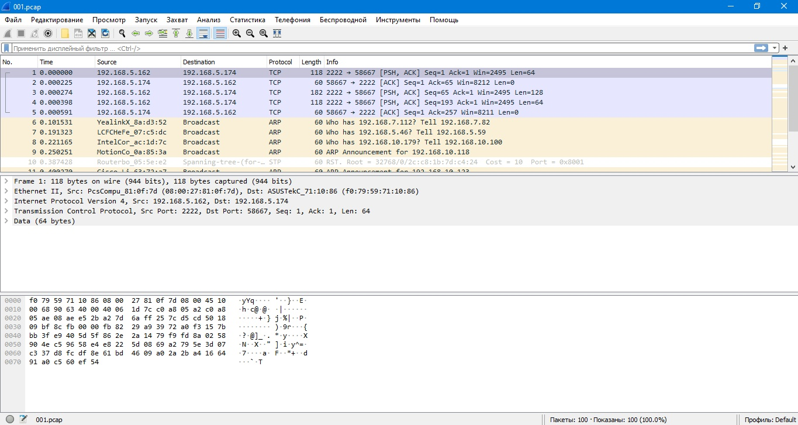

# Домашнее задание к занятию "3.9. Элементы безопасности информационных систем"

1. Установите Bitwarden плагин для браузера. Зарегестрируйтесь и сохраните несколько паролей.

Вотъ:


---

2. Установите Google authenticator на мобильный телефон. Настройте вход в Bitwarden акаунт через Google authenticator OTP.

И вотъ:


---

3. Установите apache2, сгенерируйте самоподписанный сертификат, настройте тестовый сайт для работы по HTTPS.  

Если опустить подробности установки, то вот:




---
4. Проверьте на TLS уязвимости произвольный сайт в интернете.

```
us@ubuntu:~/testssl.sh$ ./testssl.sh https://www.tion.ru/

###########################################################
    testssl.sh       3.1dev from https://testssl.sh/dev/
    (2dce751 2021-12-09 17:03:57 -- )

      This program is free software. Distribution and
             modification under GPLv2 permitted.
      USAGE w/o ANY WARRANTY. USE IT AT YOUR OWN RISK!

       Please file bugs @ https://testssl.sh/bugs/

###########################################################

 Using "OpenSSL 1.0.2-chacha (1.0.2k-dev)" [~183 ciphers]
 on ubuntu:./bin/openssl.Linux.x86_64
 (built: "Jan 18 17:12:17 2019", platform: "linux-x86_64")


 Start 2021-12-10 13:48:12        -->> 185.171.100.142:443 (www.tion.ru) <<--

 rDNS (185.171.100.142): --
 Service detected:       HTTP


 Testing protocols via sockets except NPN+ALPN

 SSLv2      not offered (OK)
 SSLv3      not offered (OK)
 TLS 1      offered (deprecated)
 TLS 1.1    offered (deprecated)
 TLS 1.2    offered (OK)
 TLS 1.3    not offered and downgraded to a weaker protocol
 NPN/SPDY   h2, http/1.1 (advertised)
 ALPN/HTTP2 h2, http/1.1 (offered)

 Testing cipher categories

 NULL ciphers (no encryption)                      not offered (OK)
 Anonymous NULL Ciphers (no authentication)        not offered (OK)
 Export ciphers (w/o ADH+NULL)                     not offered (OK)
 LOW: 64 Bit + DES, RC[2,4], MD5 (w/o export)      not offered (OK)
 Triple DES Ciphers / IDEA                         not offered
 Obsoleted CBC ciphers (AES, ARIA etc.)            offered
 Strong encryption (AEAD ciphers) with no FS       offered (OK)
 Forward Secrecy strong encryption (AEAD ciphers)  offered (OK)


 Testing server's cipher preferences

 Has server cipher order?     yes (OK)
 Negotiated protocol          TLSv1.2
 Negotiated cipher            ECDHE-RSA-AES256-GCM-SHA384, 256 bit ECDH (P-256)
 Cipher per protocol

Hexcode  Cipher Suite Name (OpenSSL)       KeyExch.   Encryption  Bits     Cipher Suite Name (IANA/RFC)
-----------------------------------------------------------------------------------------------------------------------------
SSLv2
 -
SSLv3
 -
TLSv1 (server order)
 xc014   ECDHE-RSA-AES256-SHA              ECDH 256   AES         256      TLS_ECDHE_RSA_WITH_AES_256_CBC_SHA
 xc013   ECDHE-RSA-AES128-SHA              ECDH 256   AES         128      TLS_ECDHE_RSA_WITH_AES_128_CBC_SHA
 x35     AES256-SHA                        RSA        AES         256      TLS_RSA_WITH_AES_256_CBC_SHA
 x84     CAMELLIA256-SHA                   RSA        Camellia    256      TLS_RSA_WITH_CAMELLIA_256_CBC_SHA
 x2f     AES128-SHA                        RSA        AES         128      TLS_RSA_WITH_AES_128_CBC_SHA
 x41     CAMELLIA128-SHA                   RSA        Camellia    128      TLS_RSA_WITH_CAMELLIA_128_CBC_SHA
TLSv1.1 (server order)
 xc014   ECDHE-RSA-AES256-SHA              ECDH 256   AES         256      TLS_ECDHE_RSA_WITH_AES_256_CBC_SHA
 xc013   ECDHE-RSA-AES128-SHA              ECDH 256   AES         128      TLS_ECDHE_RSA_WITH_AES_128_CBC_SHA
 x35     AES256-SHA                        RSA        AES         256      TLS_RSA_WITH_AES_256_CBC_SHA
 x84     CAMELLIA256-SHA                   RSA        Camellia    256      TLS_RSA_WITH_CAMELLIA_256_CBC_SHA
 x2f     AES128-SHA                        RSA        AES         128      TLS_RSA_WITH_AES_128_CBC_SHA
 x41     CAMELLIA128-SHA                   RSA        Camellia    128      TLS_RSA_WITH_CAMELLIA_128_CBC_SHA
TLSv1.2 (server order)
 xc030   ECDHE-RSA-AES256-GCM-SHA384       ECDH 253   AESGCM      256      TLS_ECDHE_RSA_WITH_AES_256_GCM_SHA384
 xcca8   ECDHE-RSA-CHACHA20-POLY1305       ECDH 253   ChaCha20    256      TLS_ECDHE_RSA_WITH_CHACHA20_POLY1305_SHA256
 xc061   ECDHE-ARIA256-GCM-SHA384          ECDH 253   ARIAGCM     256      TLS_ECDHE_RSA_WITH_ARIA_256_GCM_SHA384
 xc02f   ECDHE-RSA-AES128-GCM-SHA256       ECDH 253   AESGCM      128      TLS_ECDHE_RSA_WITH_AES_128_GCM_SHA256
 xc060   ECDHE-ARIA128-GCM-SHA256          ECDH 253   ARIAGCM     128      TLS_ECDHE_RSA_WITH_ARIA_128_GCM_SHA256
 xc028   ECDHE-RSA-AES256-SHA384           ECDH 253   AES         256      TLS_ECDHE_RSA_WITH_AES_256_CBC_SHA384
 xc077   ECDHE-RSA-CAMELLIA256-SHA384      ECDH 253   Camellia    256      TLS_ECDHE_RSA_WITH_CAMELLIA_256_CBC_SHA384
 xc027   ECDHE-RSA-AES128-SHA256           ECDH 253   AES         128      TLS_ECDHE_RSA_WITH_AES_128_CBC_SHA256
 xc076   ECDHE-RSA-CAMELLIA128-SHA256      ECDH 253   Camellia    128      TLS_ECDHE_RSA_WITH_CAMELLIA_128_CBC_SHA256
 xc014   ECDHE-RSA-AES256-SHA              ECDH 253   AES         256      TLS_ECDHE_RSA_WITH_AES_256_CBC_SHA
 xc013   ECDHE-RSA-AES128-SHA              ECDH 253   AES         128      TLS_ECDHE_RSA_WITH_AES_128_CBC_SHA
 x9d     AES256-GCM-SHA384                 RSA        AESGCM      256      TLS_RSA_WITH_AES_256_GCM_SHA384
 xc0a1   AES256-CCM8                       RSA        AESCCM8     256      TLS_RSA_WITH_AES_256_CCM_8
 xc09d   AES256-CCM                        RSA        AESCCM      256      TLS_RSA_WITH_AES_256_CCM
 xc051   ARIA256-GCM-SHA384                RSA        ARIAGCM     256      TLS_RSA_WITH_ARIA_256_GCM_SHA384
 x9c     AES128-GCM-SHA256                 RSA        AESGCM      128      TLS_RSA_WITH_AES_128_GCM_SHA256
 xc0a0   AES128-CCM8                       RSA        AESCCM8     128      TLS_RSA_WITH_AES_128_CCM_8
 xc09c   AES128-CCM                        RSA        AESCCM      128      TLS_RSA_WITH_AES_128_CCM
 xc050   ARIA128-GCM-SHA256                RSA        ARIAGCM     128      TLS_RSA_WITH_ARIA_128_GCM_SHA256
 x3d     AES256-SHA256                     RSA        AES         256      TLS_RSA_WITH_AES_256_CBC_SHA256
 xc0     CAMELLIA256-SHA256                RSA        Camellia    256      TLS_RSA_WITH_CAMELLIA_256_CBC_SHA256
 x3c     AES128-SHA256                     RSA        AES         128      TLS_RSA_WITH_AES_128_CBC_SHA256
 xba     CAMELLIA128-SHA256                RSA        Camellia    128      TLS_RSA_WITH_CAMELLIA_128_CBC_SHA256
 x35     AES256-SHA                        RSA        AES         256      TLS_RSA_WITH_AES_256_CBC_SHA
 x84     CAMELLIA256-SHA                   RSA        Camellia    256      TLS_RSA_WITH_CAMELLIA_256_CBC_SHA
 x2f     AES128-SHA                        RSA        AES         128      TLS_RSA_WITH_AES_128_CBC_SHA
 x41     CAMELLIA128-SHA                   RSA        Camellia    128      TLS_RSA_WITH_CAMELLIA_128_CBC_SHA
TLSv1.3
 -


 Testing robust forward secrecy (FS) -- omitting Null Authentication/Encryption, 3DES, RC4

 FS is offered (OK)           ECDHE-RSA-AES256-GCM-SHA384 ECDHE-RSA-AES256-SHA384 ECDHE-RSA-AES256-SHA ECDHE-RSA-CHACHA20-POLY1305 ECDHE-RSA-CAMELLIA256-SHA384 ECDHE-ARIA256-GCM-SHA384
                              ECDHE-RSA-AES128-GCM-SHA256 ECDHE-RSA-AES128-SHA256 ECDHE-RSA-AES128-SHA ECDHE-RSA-CAMELLIA128-SHA256 ECDHE-ARIA128-GCM-SHA256
 Elliptic curves offered:     prime256v1 secp384r1 secp521r1 X25519 X448


 Testing server defaults (Server Hello)

 TLS extensions (standard)    "renegotiation info/#65281" "server name/#0" "EC point formats/#11" "session ticket/#35" "next protocol/#13172" "max fragment length/#1"
                              "application layer protocol negotiation/#16" "encrypt-then-mac/#22" "extended master secret/#23"
 Session Ticket RFC 5077 hint 300 seconds, session tickets keys seems to be rotated < daily
 SSL Session ID support       yes
 Session Resumption           Tickets: yes, ID: no
 TLS clock skew               Random values, no fingerprinting possible
 Client Authentication        none
 Signature Algorithm          SHA256 with RSA
 Server key size              RSA 2048 bits (exponent is 65537)
 Server key usage             Digital Signature, Key Encipherment
 Server extended key usage    TLS Web Server Authentication, TLS Web Client Authentication
 Serial                       30D4DDD9DD2C4F57C209AE7C4676F134 (OK: length 16)
 Fingerprints                 SHA1 AE5F6D61B5DFE8572E553C61C7AD966B253AB168
                              SHA256 262C32A1B4108457D45A99250F460C888170208C27548CE52DAC780E5B91CB03
 Common Name (CN)             *.tion.ru  (request w/o SNI didn't succeed)
 subjectAltName (SAN)         *.tion.ru tion.ru
 Trust (hostname)             Ok via SAN wildcard and CN wildcard (SNI mandatory)
 Chain of trust               Ok
 EV cert (experimental)       no
 Certificate Validity (UTC)   179 >= 60 days (2021-06-01 00:00 --> 2022-06-07 23:59)
 ETS/"eTLS", visibility info  not present
 Certificate Revocation List  http://crl.sectigo.com/SectigoRSAOrganizationValidationSecureServerCA.crl
 OCSP URI                     http://ocsp.sectigo.com
 OCSP stapling                not offered
 OCSP must staple extension   --
 DNS CAA RR (experimental)    not offered
 Certificate Transparency     yes (certificate extension)
 Certificates provided        4 (certificate list ordering problem)
 Issuer                       Sectigo RSA Organization Validation Secure Server CA (Sectigo Limited from GB)
 Intermediate cert validity   #1: ok > 40 days (2028-12-31 23:59). USERTrust RSA Certification Authority <-- AAA Certificate Services
                              #2: ok > 40 days (2030-12-31 23:59). Sectigo RSA Organization Validation Secure Server CA <-- USERTrust RSA Certification Authority
                              #3: ok > 40 days (2028-12-31 23:59). AAA Certificate Services <-- AAA Certificate Services
 Intermediate Bad OCSP (exp.) Ok


 Testing HTTP header response @ "/"

 HTTP Status Code             301 Moved Permanently, redirecting to "https://tion.ru/"
 HTTP clock skew              0 sec from localtime
 Strict Transport Security    not offered
 Public Key Pinning           --
 Server banner                nginx/1.14.0 (Ubuntu)
 Application banner           --
 Cookie(s)                    (none issued at "/") -- maybe better try target URL of 30x
 Security headers             --
 Reverse Proxy banner         --


 Testing vulnerabilities

 Heartbleed (CVE-2014-0160)                not vulnerable (OK), no heartbeat extension
 CCS (CVE-2014-0224)                       not vulnerable (OK)
 Ticketbleed (CVE-2016-9244), experiment.  not vulnerable (OK), no session tickets
 ROBOT                                     not vulnerable (OK)
 Secure Renegotiation (RFC 5746)           OpenSSL handshake didn't succeed
 Secure Client-Initiated Renegotiation     not vulnerable (OK)
 CRIME, TLS (CVE-2012-4929)                not vulnerable (OK)
 BREACH (CVE-2013-3587)                    no gzip/deflate/compress/br HTTP compression (OK)  - only supplied "/" tested
 POODLE, SSL (CVE-2014-3566)               not vulnerable (OK), no SSLv3 support
 TLS_FALLBACK_SCSV (RFC 7507)              Downgrade attack prevention supported (OK)
 SWEET32 (CVE-2016-2183, CVE-2016-6329)    not vulnerable (OK)
 FREAK (CVE-2015-0204)                     not vulnerable (OK)
 DROWN (CVE-2016-0800, CVE-2016-0703)      not vulnerable on this host and port (OK)
                                           make sure you don't use this certificate elsewhere with SSLv2 enabled services
                                           https://censys.io/ipv4?q=262C32A1B4108457D45A99250F460C888170208C27548CE52DAC780E5B91CB03 could help you to find out
 LOGJAM (CVE-2015-4000), experimental      not vulnerable (OK): no DH EXPORT ciphers, no DH key detected with <= TLS 1.2
 BEAST (CVE-2011-3389)                     TLS1: ECDHE-RSA-AES256-SHA ECDHE-RSA-AES128-SHA AES256-SHA CAMELLIA256-SHA AES128-SHA CAMELLIA128-SHA
                                           VULNERABLE -- but also supports higher protocols  TLSv1.1 TLSv1.2 (likely mitigated)
 LUCKY13 (CVE-2013-0169), experimental     potentially VULNERABLE, uses cipher block chaining (CBC) ciphers with TLS. Check patches
 Winshock (CVE-2014-6321), experimental    not vulnerable (OK) - ARIA, CHACHA or CCM ciphers found
 RC4 (CVE-2013-2566, CVE-2015-2808)        no RC4 ciphers detected (OK)


 Running client simulations (HTTP) via sockets

 Browser                      Protocol  Cipher Suite Name (OpenSSL)       Forward Secrecy
------------------------------------------------------------------------------------------------
 Android 4.4.2                TLSv1.2   ECDHE-RSA-AES256-GCM-SHA384       256 bit ECDH (P-256)
 Android 5.0.0                TLSv1.2   ECDHE-RSA-AES128-GCM-SHA256       256 bit ECDH (P-256)
 Android 6.0                  TLSv1.2   ECDHE-RSA-AES128-GCM-SHA256       256 bit ECDH (P-256)
 Android 7.0 (native)         TLSv1.2   ECDHE-RSA-AES256-GCM-SHA384       256 bit ECDH (P-256)
 Android 8.1 (native)         TLSv1.2   ECDHE-RSA-AES256-GCM-SHA384       253 bit ECDH (X25519)
 Android 9.0 (native)         TLSv1.2   ECDHE-RSA-AES256-GCM-SHA384       253 bit ECDH (X25519)
 Android 10.0 (native)        TLSv1.2   ECDHE-RSA-AES256-GCM-SHA384       253 bit ECDH (X25519)
 Chrome 74 (Win 10)           TLSv1.2   ECDHE-RSA-AES256-GCM-SHA384       253 bit ECDH (X25519)
 Chrome 79 (Win 10)           TLSv1.2   ECDHE-RSA-AES256-GCM-SHA384       253 bit ECDH (X25519)
 Firefox 66 (Win 8.1/10)      TLSv1.2   ECDHE-RSA-AES256-GCM-SHA384       253 bit ECDH (X25519)
 Firefox 71 (Win 10)          TLSv1.2   ECDHE-RSA-AES256-GCM-SHA384       253 bit ECDH (X25519)
 IE 6 XP                      No connection
 IE 8 Win 7                   TLSv1.0   ECDHE-RSA-AES256-SHA              256 bit ECDH (P-256)
 IE 8 XP                      No connection
 IE 11 Win 7                  TLSv1.2   ECDHE-RSA-AES256-SHA384           256 bit ECDH (P-256)
 IE 11 Win 8.1                TLSv1.2   ECDHE-RSA-AES256-SHA384           256 bit ECDH (P-256)
 IE 11 Win Phone 8.1          TLSv1.2   ECDHE-RSA-AES128-SHA256           256 bit ECDH (P-256)
 IE 11 Win 10                 TLSv1.2   ECDHE-RSA-AES256-GCM-SHA384       256 bit ECDH (P-256)
 Edge 15 Win 10               TLSv1.2   ECDHE-RSA-AES256-GCM-SHA384       253 bit ECDH (X25519)
 Edge 17 (Win 10)             TLSv1.2   ECDHE-RSA-AES256-GCM-SHA384       253 bit ECDH (X25519)
 Opera 66 (Win 10)            TLSv1.2   ECDHE-RSA-AES256-GCM-SHA384       253 bit ECDH (X25519)
 Safari 9 iOS 9               TLSv1.2   ECDHE-RSA-AES256-GCM-SHA384       256 bit ECDH (P-256)
 Safari 9 OS X 10.11          TLSv1.2   ECDHE-RSA-AES256-GCM-SHA384       256 bit ECDH (P-256)
 Safari 10 OS X 10.12         TLSv1.2   ECDHE-RSA-AES256-GCM-SHA384       256 bit ECDH (P-256)
 Safari 12.1 (iOS 12.2)       TLSv1.2   ECDHE-RSA-AES256-GCM-SHA384       253 bit ECDH (X25519)
 Safari 13.0 (macOS 10.14.6)  TLSv1.2   ECDHE-RSA-AES256-GCM-SHA384       253 bit ECDH (X25519)
 Apple ATS 9 iOS 9            TLSv1.2   ECDHE-RSA-AES256-GCM-SHA384       256 bit ECDH (P-256)
 Java 6u45                    No connection
 Java 7u25                    TLSv1.0   ECDHE-RSA-AES128-SHA              256 bit ECDH (P-256)
 Java 8u161                   TLSv1.2   ECDHE-RSA-AES256-GCM-SHA384       256 bit ECDH (P-256)
 Java 11.0.2 (OpenJDK)        TLSv1.2   ECDHE-RSA-AES256-GCM-SHA384       256 bit ECDH (P-256)
 Java 12.0.1 (OpenJDK)        TLSv1.2   ECDHE-RSA-AES256-GCM-SHA384       256 bit ECDH (P-256)
 OpenSSL 1.0.2e               TLSv1.2   ECDHE-RSA-AES256-GCM-SHA384       256 bit ECDH (P-256)
 OpenSSL 1.1.0l (Debian)      TLSv1.2   ECDHE-RSA-AES256-GCM-SHA384       253 bit ECDH (X25519)
 OpenSSL 1.1.1d (Debian)      TLSv1.2   ECDHE-RSA-AES256-GCM-SHA384       253 bit ECDH (X25519)
 Thunderbird (68.3)           TLSv1.2   ECDHE-RSA-AES256-GCM-SHA384       253 bit ECDH (X25519)


 Rating (experimental)

 Rating specs (not complete)  SSL Labs's 'SSL Server Rating Guide' (version 2009q from 2020-01-30)
 Specification documentation  https://github.com/ssllabs/research/wiki/SSL-Server-Rating-Guide
 Protocol Support (weighted)  95 (28)
 Key Exchange     (weighted)  90 (27)
 Cipher Strength  (weighted)  90 (36)
 Final Score                  91
 Overall Grade                B
 Grade cap reasons            Grade capped to B. TLS 1.1 offered
                              Grade capped to B. TLS 1.0 offered
                              Grade capped to A. HSTS is not offered

 Done 2021-12-10 13:50:28 [ 140s] -->> 185.171.100.142:443 (www.tion.ru) <<--
```

---

5. Установите на Ubuntu ssh сервер, сгенерируйте новый приватный ключ. Скопируйте свой публичный ключ на другой сервер. Подключитесь к серверу по SSH-ключу.
 
Сгененрируем ключ:
```
ss@zabbix:~$ ssh-keygen
Generating public/private rsa key pair.
Enter file in which to save the key (/home/ss/.ssh/id_rsa):
Enter passphrase (empty for no passphrase):
Enter same passphrase again:
Your identification has been saved in /home/ss/.ssh/id_rsa
Your public key has been saved in /home/ss/.ssh/id_rsa.pub
The key fingerprint is:
SHA256:Pq5OEhY4AHjDe75E4RWV+9VVPaQ1RpJ5cNYT8KYAiU4 ss@zabbix
The key's randomart image is:
+---[RSA 3072]----+
|=.    .ooo.  +BX*|
|..+.. .E...  oO+=|
| .o+.oo  . . o.+o|
|  ..+. ..   o +  |
|   +o   S. . .   |
|   .o. .  .      |
|   .... o        |
|    .o . .       |
|     .o..        |
+----[SHA256]-----+
```
Cкопируем его на удаленный сервер:
```
ss@zabbix:~$ ssh-copy-id us@192.168.5.162 -p 2222
/usr/bin/ssh-copy-id: INFO: Source of key(s) to be installed: "/home/ss/.ssh/id_rsa.pub"
The authenticity of host '[192.168.5.162]:2222 ([192.168.5.162]:2222)' can't be established.
ECDSA key fingerprint is SHA256:E/WNI/LfzWbxwpZRHlXMF88r5remcmdHeXbsclk2cEU.
Are you sure you want to continue connecting (yes/no/[fingerprint])? yes
/usr/bin/ssh-copy-id: INFO: attempting to log in with the new key(s), to filter out any that are already installed
/usr/bin/ssh-copy-id: INFO: 1 key(s) remain to be installed -- if you are prompted now it is to install the new keys
us@192.168.5.162's password:

Number of key(s) added: 1

Now try logging into the machine, with:   "ssh -p '2222' 'us@192.168.5.162'"
and check to make sure that only the key(s) you wanted were added.

```
И подключимся:
```
ss@zabbix:~$ ssh us@192.168.5.162 -p 2222
Welcome to Ubuntu 20.04.3 LTS (GNU/Linux 5.11.0-41-generic x86_64)

 * Documentation:  https://help.ubuntu.com
 * Management:     https://landscape.canonical.com
 * Support:        https://ubuntu.com/advantage

0 updates can be applied immediately.

Your Hardware Enablement Stack (HWE) is supported until April 2025.
*** System restart required ***
Last login: Fri Dec 10 16:15:43 2021 from 192.168.5.174
us@ubuntu:~$
```

---

6. Переименуйте файлы ключей из задания 5. Настройте файл конфигурации SSH клиента, так чтобы вход на удаленный сервер осуществлялся по имени сервера.

Переименую ключ:
```
ss@zabbix:~/.ssh$ mv id_rsa webserver.key
```
Создам файл `config` следующего наполнения:
```
ss@zabbix:~/.ssh$ nano config
  GNU nano 4.8                                                        config
Host webserver
HostName 192.168.5.162
IdentityFile ~/.ssh/webserver.key
User us
Port 2222
#StrictHostKeyChecking no
```
Попробую подключиться:
```
ss@zabbix:~/.ssh$ ssh webserver
Welcome to Ubuntu 20.04.3 LTS (GNU/Linux 5.11.0-41-generic x86_64)

 * Documentation:  https://help.ubuntu.com
 * Management:     https://landscape.canonical.com
 * Support:        https://ubuntu.com/advantage

0 updates can be applied immediately.

Your Hardware Enablement Stack (HWE) is supported until April 2025.
*** System restart required ***
Last login: Sat Dec 11 13:00:09 2021 from 192.168.5.6
us@ubuntu:~$
```
Profit!

---

7. Соберите дамп трафика утилитой tcpdump в формате pcap, 100 пакетов. Откройте файл pcap в Wireshark.

Собираю трафик:
```
us@ubuntu:~$ sudo tcpdump -c 100 -w 001.pcap -i enp0s3
tcpdump: listening on enp0s3, link-type EN10MB (Ethernet), capture size 262144 bytes
100 packets captured
111 packets received by filter
0 packets dropped by kernel
```
Смотрим что получилось:


---
## Задание для самостоятельной отработки (необязательно к выполнению)

8*. Просканируйте хост scanme.nmap.org. Какие сервисы запущены?

9*. Установите и настройте фаервол ufw на web-сервер из задания 3. Откройте доступ снаружи только к портам 22,80,443


 ---
